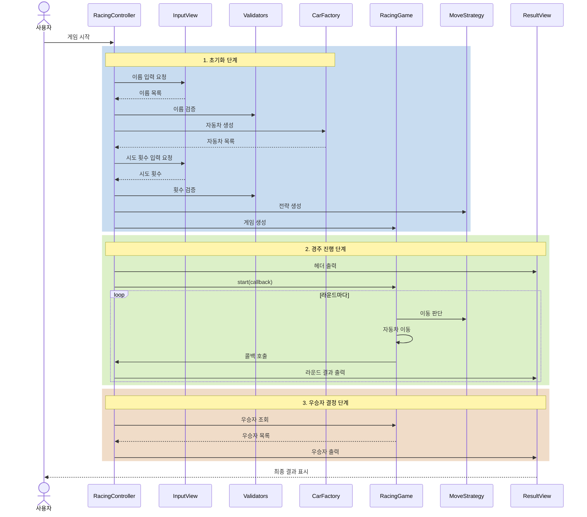
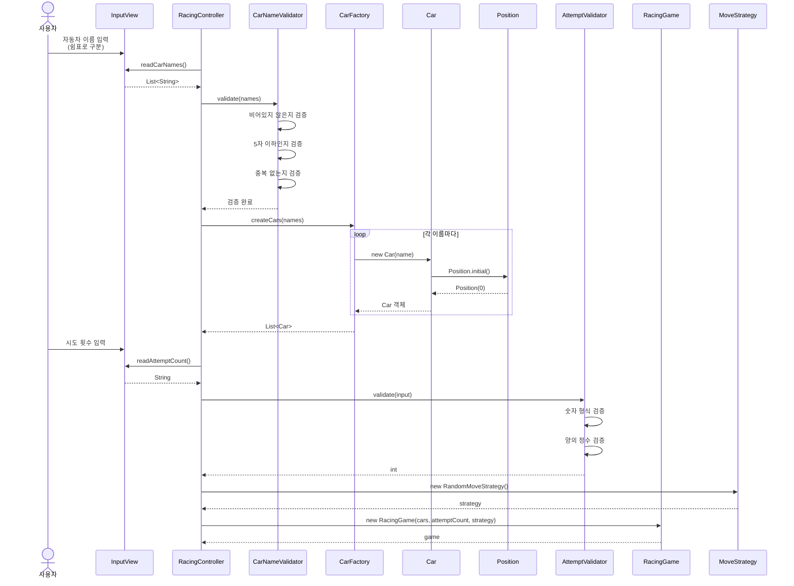
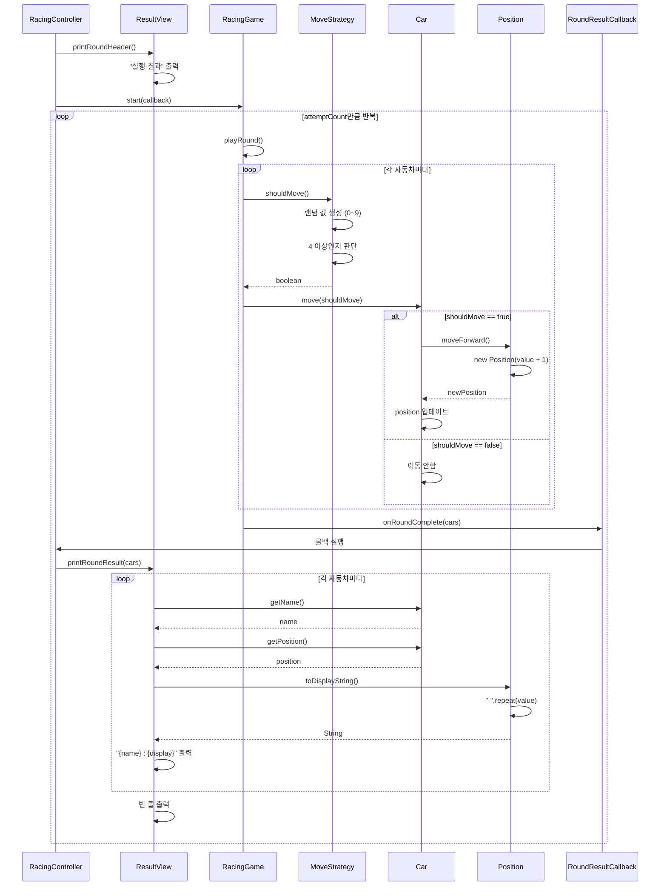
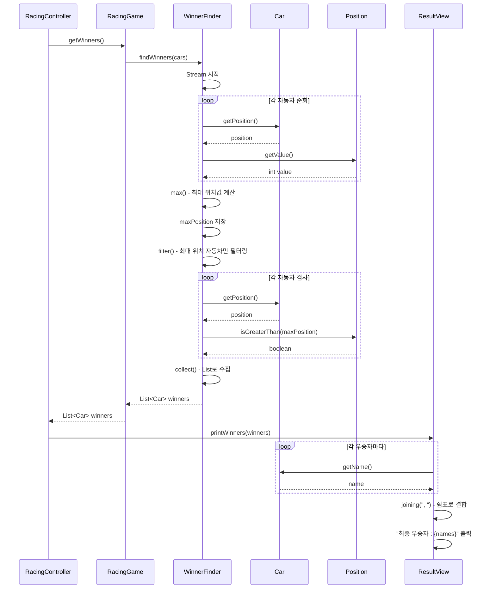

# 📚 2주차 미션 - 자동차 경주 게임

## 🎯 유즈케이스 (Use Cases)

### UC-01: 자동차 이름 입력

**목적:** 경주에 참가할 자동차들의 이름을 입력받는다.  
**사전조건:** 게임이 시작된다.  
**사후조건:** 유효한 자동차 이름들이 등록되어 자동차 객체들이 생성된다.

**주 시나리오:**

1. 시스템이 자동차 이름 입력을 요청한다.
2. 사용자가 쉼표(`,`)로 구분된 자동차 이름을 입력한다.
3. 시스템이 입력값을 검증한다.
4. 시스템이 각 자동차 객체를 생성한다.

**예외 시나리오:**

- a. 자동차 이름이 5자를 초과하는 경우
- b. 자동차 이름이 비어있는 경우
- c. 입력 형식이 잘못된 경우
    - 쉽표가 아닌 구분자
    - 연속된 쉼표

**입력 예시:**

```
pobi,woni,jun
```

---

### UC-02: 시도 횟수 입력

**목적:** 경주를 진행할 횟수를 입력받는다.  
**사전조건:** 자동차 이름이 유효하게 입력되었다.  
**사후조건:** 경주 시도 횟수가 설정된다.

**주 시나리오:**

1. 시스템이 시도 횟수 입력을 요청한다.
2. 사용자가 시도 횟수를 입력한다.
3. 시스템이 입력값을 검증한다.
4. 시스템이 경주 게임 설정을 완료한다.

**예외 시나리오:**

- a. 숫자가 아닌 값을 입력한 경우
- b. 0 이하의 값을 입력한 경우

**입력 예시:**

```
5
```

---

### UC-03: 자동차 경주 진행

**목적:** 설정된 횟수만큼 자동차 경주를 진행한다.  
**사전조건:**

- 자동차들이 생성되었다.
- 시도 횟수가 설정되었다.

**사후조건:**

- 모든 라운드가 완료된다.
- 각 자동차의 최종 위치가 확정된다.

**주 시나리오:**

1. 시스템이 "실행 결과"를 출력한다.
2. **[설정된 횟수만큼 반복]**
    - 2.1. 각 자동차에 대해 0~9 사이의 무작위 값을 생성한다.
    - 2.2. 무작위 값이 4 이상이면 해당 자동차를 전진시킨다.
    - 2.3. 각 자동차의 현재 위치를 출력한다.
        - 형식: `{자동차이름} : {-의 개수}`
    - 2.4. 빈 줄을 출력한다.
3. 경주가 종료된다.

**출력 예시:**

```
실행 결과
pobi : -
woni : 
jun : -

pobi : --
woni : -
jun : --
```

---

### UC-04: 우승자 결정

**목적:** 경주 완료 후 우승자를 결정하고 출력한다.  
**사전조건:** 자동차 경주가 완료되었다.  
**사후조건:** 우승자가 출력된다.

**주 시나리오:**

1. 시스템이 모든 자동차의 최종 위치를 조회한다.
2. 시스템이 최대 위치값을 찾는다.
3. 시스템이 최대 위치에 있는 모든 자동차를 찾는다.
4. **[우승자가 1명인 경우]**
    - "최종 우승자 : {이름}" 형식으로 출력한다.
5. **[우승자가 여러 명인 경우]**
    - "최종 우승자 : {이름}, {이름}, ..." 형식으로 출력한다.

**출력 예시:**

- 단독 우승: `최종 우승자 : pobi`
- 공동 우승: `최종 우승자 : pobi, jun`

---

## 📋 구현할 기능 목록

### 1. 입력 기능

- [x] 자동차 이름 입력 받기
    - `Console.readLine()`을 사용하여 입력 받음
    - 입력 프롬프트: `"경주할 자동차 이름을 입력하세요.(이름은 쉼표(,) 기준으로 구분)"`
- [x] 시도 횟수 입력 받기
    - `Console.readLine()`을 사용하여 입력 받음
    - 입력 프롬프트: `"시도할 횟수는 몇 회인가요?"`

### 2. 입력 검증 기능

- [x] 자동차 이름 검증
    - [x] 이름이 비어있지 않은지 확인
    - [x] 각 이름이 5자 이하인지 확인
    - [x] 중복된 이름이 없는지 확인
    - [x] 검증 실패 시 `IllegalArgumentException` 발생
- [x] 시도 횟수 검증
    - [] 숫자 형식인지 확인
    - [x] 양의 정수인지 확인 (1 이상)
    - [x] 검증 실패 시 `IllegalArgumentException` 발생

### 3. 자동차 생성 기능

- [x] 이름을 받아 자동차 객체 생성
- [x] 자동차 초기 위치는 0으로 설정
- [x] 여러 자동차를 리스트로 관리

### 4. 이동 기능

- [x] 무작위 값 생성 (0~9)
    - `Randoms.pickNumberInRange(0, 9)` 사용
- [x] 무작위 값이 4 이상인지 판단
- [x] 조건을 만족하면 자동차 전진
- [x] 조건을 만족하지 않으면 정지

### 5. 경주 진행 기능

- [x] 설정된 횟수만큼 라운드 반복
- [x] 각 라운드마다 모든 자동차의 이동 시도
- [x] 각 라운드 종료 후 결과 출력

### 6. 출력 기능

- [x] 실행 결과 헤더 출력
    - `"실행 결과"` 출력
- [x] 각 라운드 결과 출력
    - 형식: `{자동차이름} : {-의 개수}`
    - 위치 0이면 이름 뒤에 하이픈 없음
    - 각 라운드 후 빈 줄 출력
- [x] 최종 우승자 출력
    - 단독 우승: `"최종 우승자 : {이름}"`
    - 공동 우승: `"최종 우승자 : {이름}, {이름}, ..."`

### 7. 우승자 결정 기능

- [x] 모든 자동차의 위치 조회
- [x] 최대 위치 계산
- [x] 최대 위치를 가진 자동차들 필터링
- [x] 우승자 리스트 반환

### 8. 예외 처리

- [ ] 모든 예외는 `IllegalArgumentException` 발생
- [ ] 예외 발생 시 애플리케이션 종료
- [ ] 명확한 예외 메시지

---

## 🧾 자동차 경주 게임 — RDD(책임-주도 설계) 관점 정리

### 1️⃣ 협력(대화) 시나리오 — 메시지 흐름

#### 📌 게임 시작 및 초기화 시나리오

| **송신자**        | **수신자**              | **메시지**                                        | **설명**                           |
|----------------|----------------------|------------------------------------------------|----------------------------------|
| 사용자            | **InputView**        | 입력 제공                                          | 자동차 이름을 쉼표로 구분하여 입력              |
| **Controller** | **InputView**        | `readCarNames()`                               | 자동차 이름 입력 요청                     |
| **Controller** | **CarNameValidator** | `validate(List<String> names)`                 | 입력된 이름들의 유효성 검증 요청               |
| **Controller** | **CarFactory**       | `createCars(List<String> names)`               | 검증된 이름으로 자동차 객체들 생성 요청           |
| **CarFactory** | **Car**              | `new Car(String name)` *(Stream map 활용)*       | 각 이름마다 자동차 객체 생성 *(여러 번 반복)*     |
| **Car**        | **Position**         | `Position.initial()`                           | 초기 위치(0) 생성                      |
| **Controller** | **InputView**        | `readAttemptCount()`                           | 시도 횟수 입력 요청                      |
| **Controller** | **AttemptValidator** | `validate(String input)`                       | 시도 횟수 유효성 검증 요청                  |
| **Controller** | **MoveStrategy**     | `new RandomMoveStrategy()` 생성                  | 랜덤 이동 전략 생성                      |
| **Controller** | **RacingGame**       | `new RacingGame(cars, attemptCount, strategy)` | 게임 객체 생성 *(자동차 목록 + 시도 횟수 + 전략)* |

---

#### 📌 경주 진행 시나리오

| **송신자**          | **수신자**          | **메시지**                             | **설명**                      |
|------------------|------------------|-------------------------------------|-----------------------------|
| **Controller**   | **ResultView**   | `printRoundHeader()`                | "실행 결과" 헤더 출력 요청            |
| **Controller**   | **RacingGame**   | `start(callback)` *(메서드 참조)*        | 경주 시작 및 콜백 전달               |
| **RacingGame**   | **자신(self)**     | `playRound()` *(for문 반복)*           | 각 라운드 진행 *(횟수만큼 반복)*        |
| **RacingGame**   | **MoveStrategy** | `shouldMove()`                      | 이동 여부 판단 요청 *(각 자동차마다)*     |
| **MoveStrategy** | **RacingGame**   | **return** `boolean`                | 이동 여부 반환 (true/false)       |
| **RacingGame**   | **Car**          | `move(boolean shouldMove)`          | 각 자동차에게 이동 지시 *(모든 자동차 반복)* |
| **Car**          | **Position**     | `moveForward()` *(이동 시)*            | 전진 요청                       |
| **Position**     | **Car**          | **return** `Position`               | 새로운 위치 반환 *(불변 객체)*         |
| **RacingGame**   | **Callback**     | `onRoundComplete(List<Car>)` *(콜백)* | 라운드 종료 알림                   |
| **Controller**   | **ResultView**   | `printRoundResult(List<Car>)`       | 각 라운드 결과 출력 요청              |
| **ResultView**   | **Car**          | `getName()`                         | 자동차 이름 조회 *(forEach 활용)*    |
| **ResultView**   | **Car**          | `getPosition()`                     | 자동차 위치 조회                   |
| **ResultView**   | **Position**     | `toDisplayString()` *(repeat 활용)*   | 위치를 "-" 문자열로 변환 요청          |

---

#### 📌 우승자 결정 시나리오

| **송신자**          | **수신자**          | **메시지**                       | **설명**                         |
|------------------|------------------|-------------------------------|--------------------------------|
| **Controller**   | **RacingGame**   | `getWinners()`                | 우승자 찾기 요청                      |
| **RacingGame**   | **WinnerFinder** | `findWinners(List<Car>)`      | 우승자 결정 로직 위임                   |
| **WinnerFinder** | **Car**          | `getPosition()` *(Stream 활용)* | 각 자동차의 위치 조회 *(모든 자동차 반복)*     |
| **WinnerFinder** | **Position**     | `getValue()` *(Comparator)*   | 위치 값 조회 및 비교                   |
| **WinnerFinder** | **자신(self)**     | 최대 위치 계산 *(max)*              | 가장 큰 위치값 찾기                    |
| **WinnerFinder** | **자신(self)**     | 최대 위치 자동차 필터링 *(filter)*      | 최대 위치를 가진 자동차들만 선택             |
| **WinnerFinder** | **RacingGame**   | **return** `List<Car>`        | 우승자 목록 반환                      |
| **RacingGame**   | **Controller**   | **return** `List<Car>`        | 우승자 목록 반환                      |
| **Controller**   | **ResultView**   | `printWinners(List<Car>)`     | 우승자 출력 요청                      |
| **ResultView**   | **Car**          | `getName()` *(joining 활용)*    | 우승자 이름 조회 및 쉼표로 결합 *(각 우승자마다)* |

> 💡 **협력의 핵심**
> - 메시지가 인터페이스를 결정한다 *(메시지 기반 설계)*
> - 각 객체는 자율적으로 내부 구현을 선택한다 *(캡슐화)*
> - "어떻게(How)"가 아닌 "무엇을(What)" 요청한다 *(Tell, Don't Ask)*
> - 콜백 패턴으로 의존성 역전 (DIP) 준수
> - 전략 패턴으로 테스트 가능한 설계

---

### 2️⃣ 역할 · 책임 · 메시지 (Role–Responsibility–Message)

| **역할(Role)**            | **책임(Responsibility)**                  | **공개 메시지(Interface)**                                                                                           |
|-------------------------|-----------------------------------------|-----------------------------------------------------------------------------------------------------------------|
| **InputView**           | 사용자 입력 수집                               | `List<String> readCarNames()`<br>`String readAttemptCount()`                                                    |
| **ResultView**          | 경주 결과 및 우승자 출력                          | `void printRoundHeader()`<br>`void printRoundResult(List<Car>)`<br>`void printWinners(List<Car>)`               |
| **RacingController**    | 게임 전체 흐름 제어 *(입력 → 검증 → 게임 → 출력)*       | `void run()`                                                                                                    |
| **RacingGame**          | 경주 게임 진행 총괄 *(라운드 관리 + 콜백 호출)*          | `void start(RoundResultCallback)`<br>`List<Car> getWinners()`                                                   |
| **MoveStrategy**        | 이동 판단 전략 인터페이스                          | `boolean shouldMove()`                                                                                          |
| **RandomMoveStrategy**  | 랜덤 기반 이동 판단                             | `boolean shouldMove()`                                                                                          |
| **FixedMoveStrategy**   | 고정 이동 판단 *(테스트용)*                       | `boolean shouldMove()`<br>`static alwaysMove()`<br>`static neverMove()`                                         |
| **Car**                 | 개별 자동차 표현 *(위치 관리)*                     | `void move(boolean)`<br>`String getName()`<br>`Position getPosition()`                                          |
| **Position**            | 자동차의 위치 표현 *(값 객체, 불변)*                 | `Position moveForward()`<br>`int getValue()`<br>`String toDisplayString()`<br>`boolean isGreaterThan(Position)` |
| **WinnerFinder**        | 우승자 결정 로직 *(최대 위치 계산)*                  | `List<Car> findWinners(List<Car> cars)`                                                                         |
| **CarFactory**          | 자동차 객체 생성 책임                            | `List<Car> createCars(List<String> names)`                                                                      |
| **CarNameValidator**    | 자동차 이름 유효성 검증 *(5자 이하, 비어있지 않음, 중복 없음)* | `void validate(List<String> names)`                                                                             |
| **AttemptValidator**    | 시도 횟수 유효성 검증 *(양의 정수)*                  | `int validate(String input)`                                                                                    |
| **RoundResultCallback** | 라운드 종료 알림 인터페이스 *(콜백)*                  | `void onRoundComplete(List<Car> cars)`                                                                          |

---

## 📊 시퀀스 다이어그램

## 전체 흐름 시퀀스



### 게임 시작 및 초기화 시퀀스



### 경주 진행 시퀀스



### 우승자 결정 시퀀스



## 🏗️ 설계 원칙 및 패턴 적용

### 객체지향 원칙

- **SRP (단일 책임 원칙)**: 각 클래스는 하나의 책임만 가짐 (Validator 분리, WinnerFinder 분리)
- **OCP (개방-폐쇄 원칙)**: MoveStrategy 인터페이스로 확장 가능
- **DIP (의존성 역전 원칙)**: 콜백 패턴으로 RacingGame이 View에 의존하지 않음

### 디자인 패턴

- **Strategy Pattern**: MoveStrategy를 통한 이동 판단 로직 교체 가능
- **Callback Pattern**: RoundResultCallback을 통한 실시간 결과 전달
- **Factory Pattern**: CarFactory를 통한 객체 생성 책임 분리

### 테스트 전략

- **단위 테스트**: 값 객체, 검증, 계산 로직
- **통합 테스트**: 객체 간 협력 (RacingGame + Strategy + Callback)

---

## 📦 패키지 구조

```
src
├── main
│   └── java
│       └── racingcar
│           ├── Application.java
│           ├── controller
│           │   └── RacingController.java
│           ├── domain
│           │   ├── car
│           │   │   ├── Car.java
│           │   │   ├── CarFactory.java
│           │   │   └── Position.java
│           │   ├── game
│           │   │   ├── RacingGame.java
│           │   │   └── WinnerFinder.java
│           │   ├── strategy
│           │   │   ├── MoveStrategy.java
│           │   │   ├── RandomMoveStrategy.java
│           │   │   └── FixedMoveStrategy.java
│           │   └── validator
│           │       ├── AttemptValidator.java
│           │       └── CarNameValidator.java
│           └── view
│               ├── InputView.java
│               └── ResultView.java
└── test
    └── java
        └── racingcar
            ├── domain
            │   ├── car
            │   │   ├── CarTest.java
            │   │   ├── CarFactoryTest.java
            │   │   └── PositionTest.java
            │   ├── game
            │   │   ├── RacingGameTest.java
            │   │   └── WinnerFinderTest.java
            │   ├── strategy
            │   │   └── MoveStrategyTest.java
            │   └── validator
            │       ├── AttemptValidatorTest.java
            │       └── CarNameValidatorTest.java
            └── ApplicationTest.java
```

## 🧪 테스트 전략

### 단위 테스트

- **Car**: 이동 로직, 이름 조회, 위치 조회
- **Position**: 전진, 비교, 문자열 변환
- **CarFactory**: 자동차 생성
- **WinnerFinder**: 우승자 결정 로직
- **Validator**: 입력 검증 (정상/예외)
- **MoveStrategy**: 고정 전략 동작

### 통합 테스트

- **RacingGame**:
    - 콜백 호출 횟수 검증
    - 전략에 따른 위치 변화 검증
    - 라운드별 상태 추적
    - 우승자 결정

---

